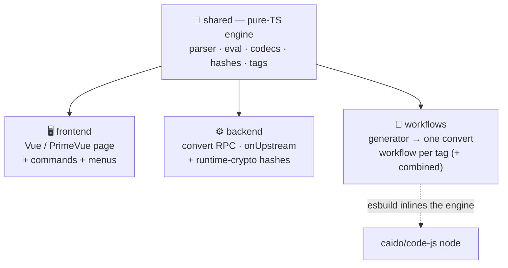

<div align="center">

# 🪄 Hackvertor for Caido

**Tag-based text conversion for [Caido](https://caido.io)** — a faithful port of
PortSwigger's [Hackvertor](https://github.com/hackvertor/hackvertor).

Wrap text in `<@tags>` to encode, decode, hash, encrypt, or transform it — from a
live converter, as native workflow nodes, in the right-click menu, or
automatically on every outgoing request.


</div>

---

## ✨ What it does

```text
<@base64>hello</@base64>                          →  aGVsbG8=
<@d_base64>aGVsbG8=</@d_base64>                   →  hello
<@base64><@sha256>secret</@sha256></@base64>      →  nested, innermost-first
<@hex(" ")>AB</@hex>                              →  41 42        (arguments)
<@uuid/>                                          →  self-closing, no input
```

Unknown or unclosed tags are left **untouched** — the parser is deliberately
tolerant, so arbitrary request data containing `<@` is never mangled.

## 🎛️ Five surfaces, one engine

| Surface | What you get |
| :-- | :-- |
| 🧩 **Workflow nodes** | One `convert` workflow per tag, named `Category: tag` (e.g. `Encode: base64`). Drop them into any workflow and chain them. |
| 🔁 **Convert operations** | The same workflows appear in the **Convert** tab and the right-click **Convert** menu (a Convert workflow *is* a Convert op in Caido). |
| 🏷️ **`Hackvertor: Tags` node** | One workflow that parses a full `<@tag1><@tag2>…</@tag2></@tag1>` string and applies everything — power-user mode. |
| 🖥️ **Hackvertor page** | Sidebar tab: live converter + category-grouped tag palette + search. |
| ⚡ **Auto on send** | Backend `onUpstream` hook rewrites `<@tags>` in outgoing requests. |

Plus right-click actions on any request/response editor: **Convert tags in
selection** and **Send selection to Hackvertor**.

> [!NOTE]
> **Auto-convert on send** requires two switches: the in-app toggle on the
> Hackvertor page **and** Caido's per-domain **Settings → Upstream Plugins**
> enabled for the target host. Both must be on for tags to be rewritten on the wire.

## 🔤 Tag syntax

| Form | Example | Meaning |
| :-- | :-- | :-- |
| Encode / transform | `<@base64>hello</@base64>` | Apply a tag to its inner text |
| Decode | `<@d_base64>aGVsbG8=</@d_base64>` | Decode variants are prefixed `d_` |
| Nested | `<@base64><@md5>x</@md5></@base64>` | Evaluated innermost-first |
| Arguments | `<@hex(" ")>AB</@hex>` | Parenthesised, quoted strings + numbers |
| Self-closing | `<@uuid/>` | No-input generators |
| Numbered | `<@base64_0>a</@base64_0><@base64_1>b</@base64_1>` | Repeat / nest the same tag unambiguously |

## 📦 Install

Grab `plugin_package.zip` from a build (see below), then in Caido:

**Plugins → Install package → select the zip.**

## 🛠️ Build

```bash
pnpm install
pnpm run build          # → dist/plugin_package.zip
```

| Script | Does |
| :-- | :-- |
| `pnpm run build` | Full build: frontend + backend + 110 workflows, merged & zipped |
| `pnpm run build:base` | Frontend + backend only (no workflows) |
| `pnpm --filter workflows build` | Regenerate + bundle the workflow definitions |
| `pnpm -r typecheck` | Typecheck every package |

## 🏗️ Architecture

The conversion engine lives in `shared` as **pure TypeScript** so the exact same
code runs in three environments — the browser page, the backend, and inside every
workflow node (esbuild inlines it, because workflow nodes can't call backend RPC).



```text
caido.config.ts       frontend + backend plugin config (drives the base manifest)
scripts/build.mjs     orchestrator: caido-dev build → workflows → manifest merge → zip
packages/
  shared/             pure-TS engine (parser, eval, codecs, hashes, all tags)
  backend/            convert RPC + onUpstream auto-convert + runtime-crypto hashes
  frontend/           Vue/PrimeVue page + commands + context-menu items
  workflows/          generator → one convert workflow per tag (+ combined)
```

<details>
<summary><b>How the workflow generation works</b></summary>

`@caido-community/dev` validates `kind: "workflow"` plugins but does **not** bundle
them, so `packages/workflows` does it:

1. **`scripts/generate.mjs`** reads the shared tag registry and writes one
   `src/generated/<slug>/{definition.json, javascript.ts}` per tag.
2. **`scripts/build.mjs`** esbuild-bundles each `javascript.ts` (externalizing
   `caido:*`) and inlines the result as the `caido/code-js` node's `code` input.
3. The root **`scripts/build.mjs`** copies those definitions into the package built
   by `caido-dev`, appends the workflow entries to its `manifest.json`, and re-zips
   deterministically.

Context/variable tags (which need live request state) are excluded from per-tag
generation and remain available in the combined `Hackvertor: Tags` node and the
backend.

</details>

## 🧰 Tag catalogue

| Category | Tags |
| :-- | :-- |
| **Encode** | base64 · base64url · base32 · base58 · hex · sql_hex · html/html5/hex/dec entities · url variants · css/octal/unicode/hex escapes · quoted-printable · js_string · powershell · php_chr |
| **Decode** | d_base64 · d_base64url · d_base32 · d_base58 · d_url · hex2ascii · d_html(5)_entities · d_js_string · d_octal/css/unicode escapes · d_quoted_printable |
| **String** | uppercase · lowercase · capitalise · reverse · length · unique · from/to_charcode · find · replace · regex_replace · repeat · substring · split_join |
| **Convert** | dec2hex/oct/bin · hex/oct/bin2dec · ascii2bin/hex · bin2ascii · ascii2reverse_hex |
| **Math** | range · total · arithmetic · zeropad · random\* · uuid |
| **Ciphers** | rotN · xor · affine · atbash · rail_fence (encrypt/decrypt) |
| **Hash / HMAC** | md5 · sha1 · sha256 (+HMAC, pure JS) · sha224/384/512 · sha3 · ripemd160 · whirlpool (backend) |
| **XSS** | script_data · iframe_src_doc · iframe_data_url · eval_fromcharcode · template_eval · throw_eval · css_expression · behavior · datasrc |
| **Variables** | set · get · increment/decrement_var · context_request/url/header/param |
| **Conditions / Date** | if_regex · if_not_regex · timestamp · date |

## 🗺️ Roadmap

- [x] Encode / Decode / String / Convert / Math / Conditions / Date / XSS
- [x] Classic ciphers (ROT-N, XOR, affine, atbash, rail-fence)
- [x] MD5 / SHA-1 / SHA-256 + HMAC (pure JS) · SHA-224/384/512, SHA-3, RIPEMD-160, Whirlpool (backend)
- [x] Variables / globals and request `context_*` tags
- [ ] Charsets (dynamic) · Faker
- [ ] Compression (gzip / deflate / brotli / bzip2)
- [ ] AES encrypt/decrypt · JWT
- [ ] Exotic hashes (Skein / Tiger / SM3 / GOST)
- [ ] Code-execution / AI tags (need the `codeExecuteKey` gating model)

## 🙏 Credits

Engine and tag semantics ported from
[**Hackvertor**](https://github.com/hackvertor/hackvertor) by
[@garethheyes](https://github.com/hackvertor) / PortSwigger. Built for
[Caido](https://caido.io).
</content>
